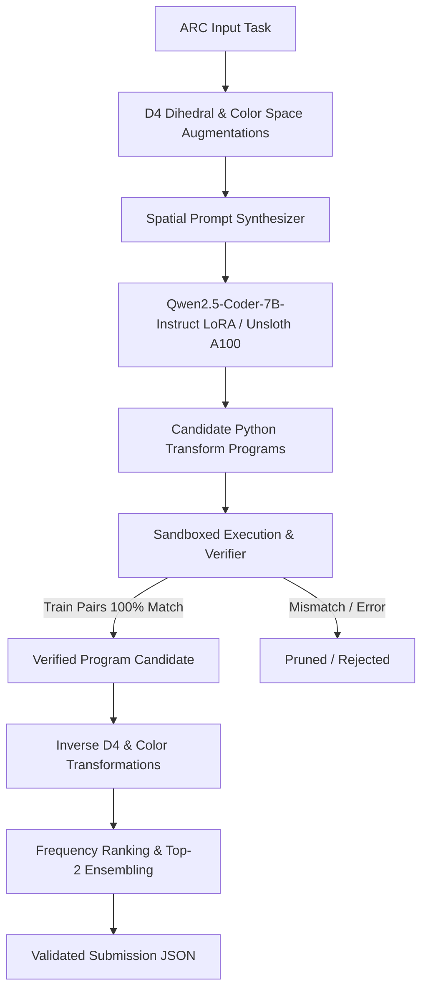

# ARC Prize 2026 SOTA Programmatic Synthesis & Test-Time Search Engine

Autonomous, high-throughput competitive engine for the **Kaggle ARC Prize 2026** ($1,550,000 prize pool across tracks). Designed for execution on NVIDIA A100 GPUs (via Google Colab Pro+ and Unsloth/vLLM) with test-time search and programmatic verification.

---

## 🏆 Competition Tracks
1. **`arc-prize-2026-arc-agi-2`** ($700,000): Classic grid reasoning and transformation synthesis.
2. **`arc-prize-2026-arc-agi-3`** ($850,000): Interactive agent environments with `arcengine` and multivariable tasks.
3. **`arc-prize-2026-paper-track`** ($450,000): Scientific discovery and architectural advances.

---

## 🏗️ Architecture & Methodologies



### 1. Data Augmentation & Exact Inverses (`src/augmentations.py`)
- Full Dihedral Group $D_4$ (8 isometric operations: identity, rotations 90°/180°/270°, horizontal/vertical reflections, transpose, anti-transpose).
- 1-to-1 Color bijections (preserving background color 0).
- Mathematical inverse functions mapping predictions back to canonical task orientation.

### 2. Isolated Execution Sandbox (`src/sandbox.py`)
- Restricts untrusted generated Python code from executing unsafe system operations.
- Enforces per-grid timeout (2.0s default) to guard against infinite loops.
- Programmatic exact match verifier: accepts candidate code only if it reproduces 100% of the demonstration train pairs:
  $$\forall i \in \text{Train}: \quad \text{transform}(\text{in}_i) = \text{out}_i$$

### 3. Reasoning & Code Generation (`src/prompts.py`)
- Formats ARC tasks with explicit matrix dimensions, numeric representations, and spatial reasoning instructions.
- Generates standard `def transform(grid: list[list[int]]) -> list[list[int]]:` functions compatible with numpy and standard python math.

### 4. Test-Time Search & Ensembling (`src/search.py`)
- Combines Test-Time Augmentation (TTA) with diverse temperature sampling.
- Aggregates verified outputs across all orientations.
- Selects the top-2 distinct candidate predictions per test query to maximize Kaggle ARC evaluation scoring.

### 5. Benchmark & Submission Engine (`src/evaluator.py`, `src/submission.py`)
- Formats outputs strictly to the Kaggle submission specification:
  `{"<task_id>": [{"attempt_1": [...], "attempt_2": [...]}]}`
- Validates grid boundaries (max 30x30) and color codes (0-9).
- Automated submission via `kaggle competitions submit`.

---

## 🚀 Getting Started

### Local Setup
```bash
# Clone the repository
git clone https://github.com/keejkrej/kagglecracker.git
cd kagglecracker

# Install dependencies with uv
uv pip install numpy
```

### Run Unit Tests
```bash
python -m unittest arc_prize_2026.tests.test_pipeline
```

### Colab A100 Deployment
1. Open Google Colab and set Runtime to **NVIDIA A100 GPU** (`Runtime -> Change runtime type -> Hardware accelerator -> A100 GPU`).
2. Run the prepared notebook: [`notebooks/arc_a100_unsloth_pipeline.ipynb`](notebooks/arc_a100_unsloth_pipeline.ipynb).
3. The notebook will automatically:
   - Verify A100 GPU and high-bandwidth memory.
   - Install Unsloth, vLLM, and dependencies.
   - Mount Google Drive for persistent checkpoints and submissions.
   - Execute the test-time search and generate Kaggle submissions.
